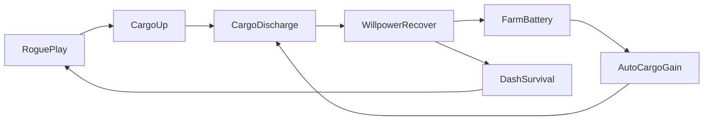
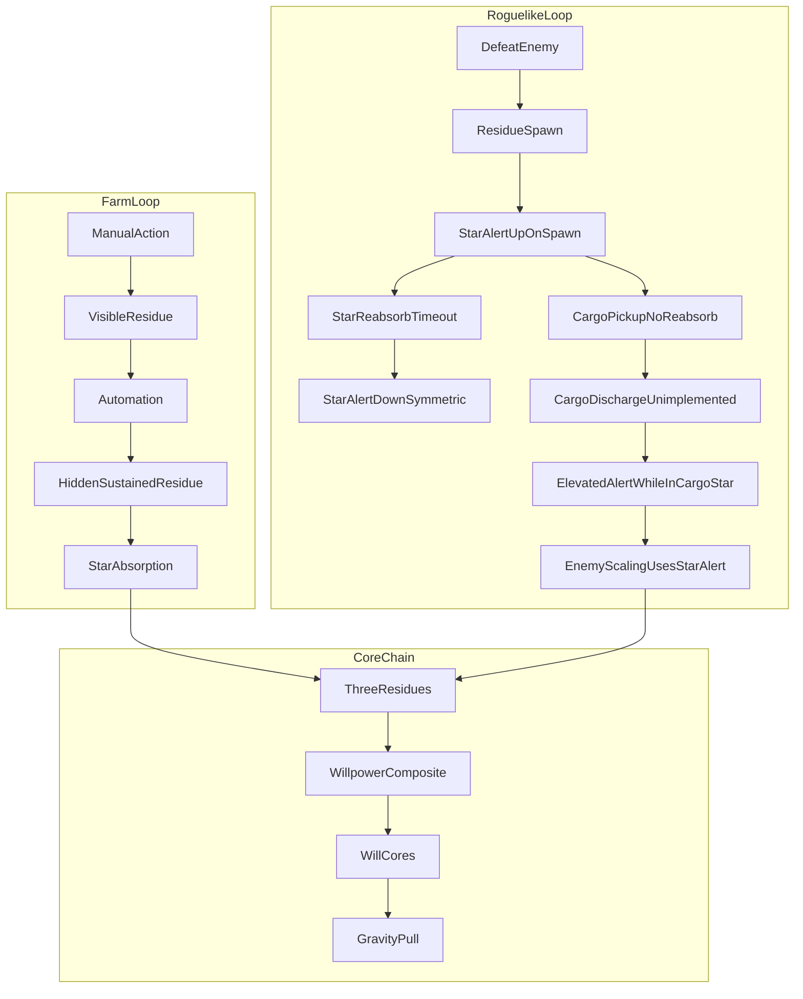
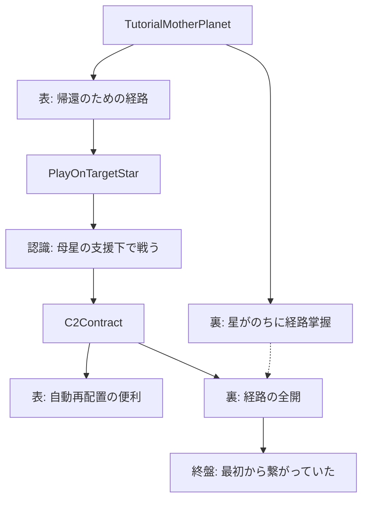
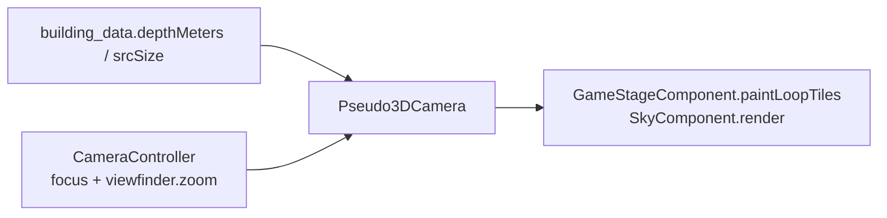

# プロジェクト定義ドキュメント：あながあったら、はいりたい (v8.5)

※本版は冗長説明・重複表・自明な総括を削ぎ、設計・実装に効く情報を残した要約改訂。  
※v8.1: 二重ゲームサイクル、残滓発生源2分類、意志の核↔意志力の連鎖、母星との三接続点、調和比率と微粒子回収の体験要件を追記。  
※v8.2: **調和比率の二層化**（§1）、**チップの段階モデル**・奪い合いの質量保存メモ・被ダメ時の回収不能残滓（§1・§4）、**ファーム軸の語彙整合**・裏共通エスカレーション（§5）、**ゲームオーバー演出と `wither` の境界**（§7・§19）、**メイン接続ゲート一覧**（§22）。  
※v8.2 追補: **残滓微粒子のスポーン／星再吸収と `starAlertLevel`**（§4・§5・§19）。カーゴからの解き放ちは拡張案（§4）。  
※v8.2 追補2: **設計上の主従**（§5）——ストーリー／選択の重みを上位、二重ループを**操作の手ごたえ・身体学習**の下層とする整理。**場所の語り2層**（母星／対象星）と**ステージ数・屋外 ID 枚数の位置づけ**（§22）。  
※v8.3: **ステージ移動時の微細トリガー**（§6）——ローグ／ファーム／探索／特殊の回収条件と反映先4系統。**マクロルート再定義**（Nourishment／Destroy／Normal／True、父のメモ・進行ロック・周回報酬）。**自動化ショップ**（A〜D 段階・C-2 で Nourishment 確定・不可逆ライン・ナッジ）。**図鑑5分類**と**つながりの不可逆**（§7）。**`resetStageState` 周りの per-stage 値はルート設計から切り離し**（§19・§22。※実装追随は別タスク）。**True 到達シーケンス**（§16・§17）。**地下・TerrainField・KinematicMovement（四隅 clamp・プローブ分担）・小段差**（§23 追補）。  
※v8.5: **屋外ライティングを全プラットフォームで Canvas per-component に統一**（旧 PC シェーダー／viewport 全面オーバーレイ経路を廃止）。**マスク生成**と**ランタン punch ベイク**の用語分離、**可視帯カリング**（§23-L・§23-M）。実装の正は `lib/component/game_stage/lighting/`。  
※v8.5 追補: **プレイヤー可視2資源**、**二重ループのやり甲斐骨格**、**カーゴ discharge→意志力回復（未実装）**、**チュートリアル搬入経路の表裏**と **C-2＝経路全開**、**ベテラン調査員（母星の縮図）**（§4・§5・§7・§8–§11・§13）。  
※v8.5 追補2: **屋外疑似3Dカメラ**（`Pseudo3DCamera`）と **`building_data.dart` 背景定義台帳**（§23-N）。パララックス・奥行きズーム・`srcSize` ピクセル基準の役割分担。実装の正は `lib/game/pseudo3d_camera.dart`・`lib/component/camera_component.dart`・`lib/component/game_stage/building/building_data.dart`。  
**用語**: 本文の「残滓」は§4の「痕跡」と同位。**実装の正**は `game_runtime_state.dart`・当たり判定を正とする。**ベテラン調査員**＝母星チュートリアル／カーゴ通信の主な相手（脚本名 **TBD**）。既存の「おじさん」は**同一人物の通称**（DLC 商品名は変更しない）。

---

## [全般]

### 1. 世界観：歴史を喰らう「惰性の星」

* **コア**: 利便性を餌に意志・歴史を捕食し、「市民」として再出力する惑星規模システム（父の技術が自己肥大した結果）。
* **三資源と市民化の式**: 無機（器）＋生命（意志→行動の駆動熱）＋歴史（記憶・文化・関係＝人格回路）→ 内面ごと再構成された市民。歴史が欠けると、能率は高いが会話・名前・趣味のない「市民」になる。
* **少女**: 父が埋めた「意志抽出防止チップ」により**人格の最深部（意志の核の根）への到達を遮る**。これは「意志力や痕跡が一切掠られない」こととは別レイヤー。**捕食側は意志力を削りうる**が、チップがある限り核の根までフォーマットできず、§17 の記憶再接続など「器としての少女」の論理と整合する。星は肥育のため墜落・**再マテリアライズ**を繰り返す（少女は「自分」を保ったまま再出力）。

**意志の核 ← 意志力 ← 三残滓（因果の芯）**  
この星は世界中の**残滓**を集め、内部で**意志力**を構成する。その意志力が**引力**として働き、母星の三要素（生命・無機・歴史の送還・吸引の文脈）を引き寄せ、**意志の核**が肥大する。プレイヤーがカーゴで残滓を母星へ抜く行為は、この閉ループへの介入（奪還）として既存の「三資源表」と整合する。

**（オプション・世界観公理）意志の核の「奪い合い」**  
説明責務のために、対象の閉じた系では「母星側の意志の核相当量＋その星側の意志の核相当量≒一定」とみなせる。**プレイヤー可視範囲ではほぼ保存**に見え、銀河規模では別バネがある——などの補助線で実装メーターと両立させる。v8.1 本文に明示式はなかったが、ストーリー整合のための追加メモとしてよい。

**残滓の発生源（2種）**

| 種別 | 内容 | 例 |
| :--- | :--- | :--- |
| **衝突・共鳴型** | 意志 × エンティティ（敵・地形・歴史オブジェクト等）の相互作用 | 敵撃破、採掘、会話・遺品触媒 |
| **燃焼型** | 意志そのものが消費される | ダッシュ、労働、UI依存による `consumeWillpower` |

**残滓→意志力の調和比率（設計値）——二層で読む**

| レイヤー | 比率・役割 | 正の所在 |
| :--- | :--- | :--- |
| **システム換算（プレイログ・カーゴ蓄積→意志力複合体）** | **生命 : 無機 : 歴史 = 4 : 6 : 1**（加重）。加重換算後の残滓量 **100 単位 → 「意志力換算1」**、**換算100 → 意志の核 1 個分の語り上の対応**（`GameRuntimeState.residueHarmony*`・§19 と一致。**実装の正はコード**）。 |
| **語り・母星レシピ（健全な文明／人格回路を維持する摂取の理想）** | **生命 : 無機 : 歴史 = 1 : 1 : 1** を「バランスよく食べる」目標として通信・イベント・長期ログで参照できる。偏重は §10・§14 と矛盾しない。**換算係数を 1:1:1 に変えることとは別**。 |

**「別レイヤー」の意味（要約）**  
ゲームの数値計算（カーゴ個数→意志力への換算・UIゲージ）は **4:6:1 のまま**動かす一方で、母星への送還が「健康的か」「文明が跛行しないか」を語る台詞・通信・イベント条件では **等量バランス（1:1:1）を目標線・メタファーとして参照する**——という**役割の分離**。前者はコードと結びつく「換算式」、後者は脚本・クエスト・エンドコンテンツの「評価軸」であり、混ぜない。

**歴史を欠いた配合のやり込み**  
§1 の市民化式どおり歴史欠乏は「能率だけの市民」に寄るが、語り上は **生命×無機偏重のみの再生産**などで**バケモノ化・住民被害**まで踏み込める。**ストーリークリア後の検証コンテンツ**向け。§8-B の偏り演出とも連動しうる。

### 2. 父への感情的動機

使命ではなく記憶: 名前で呼んだのは父だけ／反骨を「それが君だ」と認めたのも父だけ／アーカイブ音声が他と混ざらず父だとわかった——日記断片やプロローグの裏で接続させる。**最終目標（語り）**: プレイヤーは **意志を持った状態の父を母星に取り戻す**ことを目指す（到達は §16・§17 のマクロルートと True シーケンスで記述）。**ベテラン調査員**（§11）との対比——父は星の深部を最も知っていた（だから消えた）。調査員は父を知るが深部は知らない。

### 3. 母星の危機と三資源——認識のズレと「欲しがる理由」

* かつて同じインフラが「支援→吸引」へ反転。**便利さ**: 助ける → 代る → 人間を要らなくする。
* 母星は本質を知らず「送るとマシになる」**対症療法**に依存。資源は**文明維持剤**として運用される。

**三資源の実体**（両者の誤解の前提）: **生命**＝意志が行動に変わるときの駆動熱。**歴史**＝記憶・文化・関係性の断片（人格回路の材料）。**無機**＝星自身の構造を削った破片（器・インフラの基材）。

| 資源 | この星側——なぜそれが欲しいか | 母星側——なぜそれが欲しいか |
| :--- | :--- | :--- |
| **生命** | 最高効率の燃料。**意志→行動→干渉**の変換エネルギーで本体を駆動し、市民再生産ラインを回せる。「抵抗して動けば動くほど」痕跡が増え、捕食・肥育にも都合。**依存UI**で意志を摩耗させつつ手を動かさせるのも、この熱を安定供給する設計として都合がいい。 | **公式**：活動性・集中度・休眠の改善、工場稼働、経済システム復旧。**本音に近い理由**：インフラを止めないための**延命**（効く経験則があるがしくみは不明）。即効きが評価されやすい。 |
| **歴史** | 人格という形でエネルギーを流通させる**経路と素材**：名前・喪失・関係や文化が「回路」になり、再利用・均し・上書きしやすい。奪えば個の輪郭を市民型にそろえやすい。プレイヤーが記録として固定した痕は星は吸い戻して取り込みたいが、カーゴで母星へ抜けると、その分だけ星の側で再利用できていた回路が外部へ逃げる（奪還競合になる）。 | **公式**：人格安定、物忘れ・虚無感の是正、名前や芸術や喪の回復。**本音に近い理由**：「人であること」を繋ぐ薬。**効きが遅い**ので生産復興とは両立が難しく、政府・効率側からは優先順位が下がりやすい。 |
| **無機** | 自分の体表・内層の**建材**。構造としての質量維持、防衛単位や地形の増補、器の基材にそのまま流用できる。プレイヤーが破壊・採掘で剥がすと**痛みと欠損**として記録され、警戒が上がるが、奪還・再吸収で局所修復にも使える。 | **公式**：電力・医療・建築など**肉体とインフラの最低限**。**本音に近い理由**：今を物理的につなぐだけならそれでいい。**心は取り戻さず**社会を転がせるので、結果として「動いているが眼が死ぬ」。 |

**母星側で共通して起きること（「欲しい」の帰結）**
* **生命を多く送る**：社会は動く。会話・趣味・儀式が細る（人間らしさの静かな剥落）。
* **歴史を多く送る**：互いを名前で呼び、過去や喪を扱える。復興ペースや指標には劣りやすく、政治的摩擦が増えやすい。
* **無機を多く送る**：生命線は維持できる。人格面の改善はほぼ期待できない。

**核心**: 「症状緩和」と「侵食（または空洞化）」は同時。生命資源は飢餓・停止・自殺を減らすため否定し切れないが、その代わりとして**自分で決めて生きる厚み**が削れる。

---

## [ゲームサイクル]

### 4. コアループ：残滓の漏れとカーゴ

**カーゴは母星の残滓回収ユニット**（星の協力ではない）。

行動すると**残滓（痕跡）**が半物質化して世界に滲む。プレイヤーは資源を「採りにいく」のではなく、**行動のたびに何かが漏れる**状態にある。**体験要件**: 回収対象はエフェクトのみにせず、**触れてカーゴに回収可能な微粒子**として世界に存在しうる。星は粒子を**引力で吸い寄せ**、プレイヤーと**奪い合い**になる。

| 資源 | 例となる行動 | 世界に滲むもの |
| :--- | :--- | :--- |
| 生命 | ダッシュ・戦闘・労働・UI依存・運搬 | 赤い粒子＝生きようとした熱 |
| 歴史 | 会話・日記・遺品・名前・墓など | 青い残響＝意味と関係の痕跡 |
| 無機 | 採掘・建物・深層掘削・敵装甲など | 黒い破片＝構造への干渉 |

**警戒度との関係（回収可能微粒子の会計）**  
星上での破壊などで **`ResiduePickup` が現れるとき**、その粒子ひとつの `cargoValue` と種別に応じて `starAlertLevel` が**加算**される（係数と呼び出しの正は `residue_pickup.dart` と `GameRuntimeState.addStarAlertLevel`。**生命が最大**で、歴史・無機は**緩やか**）。粒子が寿命で星に再吸収されると **同量が減算**される。プレイヤーが**カーゴに回収**したときは粒子が寿命経路へ進まないため **減算が起きず**、その分だけ警戒が頭に残る——星から母星への**奪還**。カーゴは**引力に飲まれない前に送る奪還装置**。**発射確認の集計**が「自分のプレイの傾向」の自覚の瞬間。

**拡張案（未実装）: カーゴから地上へ解き放つ**  
敢えて既に収めた残滓を星側に**返す／地上にばらまく**経路で、警戒を下げる・難易度を調整できる（UI・演出と `spawnSingle` の `addStarAlertWhenSpawned:false` と `subtractStarAlertWhenAbsorbed:true` の組み合わせ等で検討）。  

**被ダメ時の「回収不能」残滓（設計メモ）**  
対象星はカーゴ内残滓と少女側の痕跡を奪い返そうとする語りと両立させ、被ダメで**短命／射程外／引力で不利**などにより通常の微粒子回収から外れた粒子が飛び散る演出を許容する（§8-C の引力強化局面ほど過酷）。粒子は寿命後に星へ吸収されうる——プレイヤーは「掠め取られた」と体感する。**実装**: 敵接触ストレス時に `ResiduePickup.spawnCaptureResistantBurst`（回収不可・短命パーティクル）。

**プレイヤーが触る資源（ゲームプレイ上は2つ）**

| 資源 | プレイヤーへの意味 |
| :--- | :--- |
| **意志力** | 行動の燃料・生存の条件 |
| **カーゴ** | 溜めて撃つ → 意志力が戻る（**セッション内 discharge・未実装**） |

**設定上の連鎖**（§1）: 三残滓 → 意志力 → 意志の核。プレイヤーは**種別を意識せず**微粒子を拾うだけ。三種はカーゴ内の**色の混ざり**として見える（§7 HUD は身体学習用。配分最適化は教えない）。

**カーゴの二操作（用語分離）**

| 操作 | 目的 | 実装 |
| :--- | :--- | :--- |
| **セッション内 discharge（撃つ）** | カーゴ消費 → 意志力回復・重い演出。ループの中心報酬（§5） | **設計目標・未実装**（現状の回復は地下休息 `reclaimWillpower` 等） |
| **ステージ跨ぎ射出（母星送還）** | 進行・通信・ログ（§8-A・§10・§22） | `launchCargo` 等（既存） |

### 5. 二重ループ（ファーム比喩／ローグライク比喩）とストーリーによる意味の回収

**やり甲斐の骨格（要約）**

| 軸 | コア快感 |
| :--- | :--- |
| **ローグ** | 「強くなるほど危険になる」——自分が強いから敵も強い、という**エスカレーションの共犯感** |
| **ファーム** | 「手を離せる」解放感と「次が見える」段階解放 |
| **共通** | カーゴを撃つ（discharge）瞬間の達成感（**未実装**） |
| **接続** | **意志力の往来**——どちらのループでも動く。戦いたい／眺めたいで自然に選べる（強制切替なし） |

**ジャンル比喩としての二軸**（メタ表現でよい）:

* **ファーム（自動化の快感）**: 手作業で回すループを楽しみ → **自動化**で意志を機械・インフラに預ける快感。設計上のねらいは「自動化していく過程そのものを遊びにする」こと。**語り・開示側では「服従」だけでなく**、その結果として対象星に**安定した駆動熱と回路素材が供給され、星の破壊・再生産・捕食ラインが回る**——§10「感謝という名のホラー」と同一の力学を**戦闘以外の経路**から踏んでいると読める（プレイヤーは快適さに乗りやすい）。**自動化が進むほど星に「余裕」が生じ、NPC が不釣り合いに暖かく接してくる**といった**不気味体験**を許容する（Nourishment 側の語り。§6）。
* **ローグライク（力の増大の快感）**: 自分が強くなる一方で、星が残滓を浴びて**警戒し、敵が強くなる**。ねらいは「駆動熱と脅威が共に積み上がる過程を遊びにする」こと。**C-2 未契約で殺戮偏重・カーゴ回収偏重**は **Destroy** マクロルート側へ寄せ、終盤で星が奪還に本気になる語りと接続する（§6）。

**裏モデル（ローグ／ファーム同時進行の許容）**  
時間軸で「どちらか一方だけ」と限定しない。**単一のエスカレーション（警戒・引力・交易インフレ・敵強化など）を共有し、表現だけループごとに変える**と §12 のログ思想と整合する。開示パイプライン（§13）はプレイ順には依存しないが**段階のロック順は設計側で固定**する。

**物語構造**: **優先度として**、プレイヤーに「選んだ重み」を返すのは主に **行動ログ→星の反応・分岐**（§8 の接続点、§12 のログ思想、§22 のゲート）である。一方、ファーム／ローグの二軸は **ゲーム操作としての手ごたえ**と残滓・警戒の身体学習（§7）を届ける下層として実装しうる。まずそれぞれのサイクルで**遊びとして成立**させ、プレイヤーが慣れたうえで、**開示（§13）と母星通信・星の変化**を通じて、**その行いの意味をストーリー側で回収**する。二ループは「テーマの二面」であり、終盤で残滓・引力・母星の歪みに収束する。

**プレイ時間の設計目標（目安）**: ファーム軸・ローグ軸それぞれで「**最低限の一周の体感**（ファームなら収穫・自動化の立ち上がり、ローグなら該当レベル帯の敵との循環）」に**おおむね各~3時間**を目安（短縮可能だが、**ルールの体感が先**）。

#### ローグライクループのやり甲斐

**循環**: 敵を倒す → 残滓粒子がスポーン（星が引力で吸い寄せる前に取る）→ カーゴが増える → **discharge（撃つ）で意志力回復**（未実装）→ `starAlertLevel` 上昇 → 敵が強くなる → 強い敵ほど多くの粒子 → 再戦。

**「もう一回」の引力**（§4・§8-C）: 粒子が星に吸われる寸前に取れた／取り逃した——「惜しい」と「取れた」の繰り返しがセッションを引き伸ばす主軸。

| 行動 | 行動即時（感覚） | 蓄積（ゲーム） |
| :--- | :--- | :--- |
| 敵を倒す | ヒットストップ・粒子が飛ぶ | カーゴ増 |
| 粒子を星より先に取る | 吸引に逆らう引力の手応え | カーゴ増 |
| カーゴを撃つ | 発射の重い演出 | 意志力回復（**未実装**） |
| 強敵を倒す | 大量の粒子が舞う | 大量カーゴ・クラフト素材 |

**クラフトによる戦闘の広がり**: 基本武器で戦える → クラフト武器で戦い方が変わる → 同じ敵が別体験になる → 「これで試したい」が生まれ、再プレイ動機になる。

#### ファームループのやり甲斐

**循環**: 自動装置を設置 → 装置が残滓を集める → プレイヤーは別のことをしてよい → 戻ったらカーゴが増えている → **discharge**（未実装）→「動いてた」満足 → もっと効率よくしたい。

**段階解放「次が見える」**（自動化ショップ・マクロ）: 常に**次の段階の存在だけ**ぼんやり見せる（詳細・数値は隠す）。A 解放で B の輪郭、B 解放で C の輪郭。

| マクロ | やり甲斐（プレイ感） | 細目（仕様メモ） |
| :--- | :--- | :--- |
| **A** | 置いておくだけで増える | A-1〜A-3 |
| **B** | 戦闘に集中できる（意志力の自動消費） | B-1〜B-3 |
| **C** | 契約の重さ（もう戻れない） | C-1、**C-2**（Nourishment・§11 経路全開） |

| 段階 | やり甲斐 |
| :--- | :--- |
| 手動（段階前） | 自分で動いた分だけ増える達成感 |
| **A** | 「置いておくだけで増える」最初の感動 |
| **B** | 戦闘に集中できる解放感 |
| **C-2** | 「もう戻れない」という決断の重さ |

**眺める報酬**: 自動化が進んだ状態で操作せず画面を眺めると、装置・粒子・カーゴの色が動いている——**見るだけで楽しい**状態を作る（§9 と接続可）。

#### 二つのループの接続（意志力の往来）

* ローグで稼ぐ → カーゴ **discharge** → 意志力回復（未実装）  
* 意志力をファームに使う → バッテリー補充 → 自動装置が動く → カーゴ増 → **discharge**  
* 意志力をローグに使う → ダッシュ・生存  
* **戦いたい気分** → ローグ側。**眺めたい気分** → 装置を整える。どちらでも意志力とカーゴは動く。

（`CargoDischarge`／`WillpowerRecover` は**設計目標・未実装**）

**ファーム側の段階構造**（語り上の3段階。ショップマクロ A/B/C と対応）

1. **手動** → 意志を直接使用 → 残滓が行動に比例して**見える**  
2. **自動化** → 意志を機械に預ける → 残滓の発生が**見えにくい**が**出続ける**  
3. 気づかないうちに**蓄積・吸収**され、星と母星へ効く

**自動化と装置（共通規則）**  
**自動装置系アイテム**は **駆動装置**に **バッテリー（意志力）** を補充すると動く。

**自動化ショップ（ファームサイクル・設計ツリー）**  
対象星上の UI／取引として**残滓・意志力・意思の核・母星人間**などを支払い、段階を追って解放する。以下は**仕様メモ**（数値・実装キーは実装側で確定可）。**C-2** は **§6 Nourishment 確定スイッチ**として扱う。

| 段階 | 概要 |
| :--- | :--- |
| **A-1** | 回収した**残滓**を支払えば、**数秒間**敵のドロップアイテムを**自動回収**する |
| **A-2** | 残滓の**自動支払い**を続ければ、ドロップの**継続自動回収**が可能になる |
| **A-3** | 残滓の自動支払いに**コストを追加**すれば、**回収量が2倍**になる |
| **B-1** | **意志力**を支払えば装置を **25% 回復**する |
| **B-2** | 意志力の**自動支払い**を続ければ、装置の**攻撃力は下がる**が**手動バッテリー補充は不要**になる |
| **B-3** | 意志力の自動支払いに**コストを追加**すれば、装置の**耐久は下がる**が**装置レベル自動上昇**が入る。加えて**火炎瓶を10個**取得 |
| **C-1** | **意思の核**を支払えば装置に**強力なシールド**を張れる |
| **C-2** | **表**: 装置破壊時に意思の核を自動消費し**同位置に自動再配置**する便利な契約。**裏**: §11 チュートリアルで繋いだ**搬入経路の全開**（取り返しのつかない）。火炎放射器取得。**Nourishment 確定**（§6） |
| **D-1** | **母星の人間を1人**支払えば、プレイヤーの**意志の核を1つ**入手し、**核0.5個分の意思力**を入手（§14 の「正解なし」と §10 のホラー文脈で**プレイヤー選択の極端な歪み**として扱う） |
| **D-2** | 母星の人間を**1時間に1人**支払い続ければ、**1時間に1つ**意志の核、その都度**核1つ分の意思力** |
| **D-3** | 母星の人間の支払いを**さらに1人分**増やせば**全装置無敵**、**エネルギーガンサーベル**取得 |

**不可逆ラインとナッジ（ファーム）**  
自動化を**一定以上**進めると「**このゲーム内でこれ以上進めると、ルートを跨いで戻せなくなる**」旨を、**メッセージウィンドウ**や**軽い不気味エフェクト**で示す。恐怖より**「まぁいいや」と踏み切れる**程度のトーンを想定。**C-2** 以降、星は支払う残滓以上に**回収する意志の核**があり得るため総合リソースは**増加傾向に寄りやすく**、**どれだけ殺戮しても Nourishment 側へ寄る**語りと整合する。**ゲーム側ナッジ**: プレイ初期体験として **Nourishment → Destroy** の順で触れさせる工夫を許容する（§6）。

**ローグライクサイクル（クラフト）**  
上記「クラフトによる戦闘の広がり」を参照。一部レシピから**ファーム用装置**も作れる想定（**具体は TBD**）。

再吸収に乗った粒子は同量が減算され、敵の強度などは**常に現在の** `starAlertLevel` を読む（実装はコード）。

### 6. ステージ移動トリガーとマクロルート

#### 6.1 ステージ移動時の微細トリガー（シナリオ差し替えなし）

**発火タイミング**: **ステージ（屋外 ID・区間）を移動するとき**。**全体シナリオの差し替え**は行わず、**永続フラグ・ログ・パラメータ**にのみ反映する。

**条件の取り出し元（4カテゴリ）**  
プレイ中に回収できる事象を、以下のいずれかに分類してトリガー条件とする。

| カテゴリ | 例 |
| :--- | :--- |
| **ローグライクサイクル** | 敵撃破・ドロップ回収・警戒上昇・特定クラフト完了 など |
| **ファームサイクル** | 自動装置の稼働・自動化ショップ契約・残滓／意志力の自動支払い など |
| **探索** | NPC へのインタラクト、`consume` タイプアイテムのぶつけ・共闘成立・キル など |
| **特殊** | ステージを跨がなくても発火しうるもの（例: **累計意志力消費が閾値を超えた**→青い UI メッセージで「自動化ショップボタンが解禁」等、**星の仕業**としての通知） |

**トリガー条件の大別（設計メモ）**  
* **資源がもたらす星・環境への影響**  
* **プレイヤーと関係を築いた NPC／敵への影響**（「**つながり**」§7）

**反映先（フィードバックの4系統）**

1. **母星もしくは探索対象の星の状態**（地形・警戒・偏り演出など）  
2. **NPC の態度や外観**  
3. **敵の反応や種類**  
4. **主に通信してくれる相手の言葉選び**

**例（探索）**  
* ある NPC に**食料（consume 型アイテム）**をぶつけて共闘→**つながり**。**兄弟 NPC** の会話差分・報酬・星破壊直前の少女の一言 などに波及。  
* 同一 NPC を殺害→図鑑には登録されるが**画像が黒塗り**。兄弟との会話も変化。

**例（ローグライクサイクル）**  
* 店の看板を落とす等の条件を満たし**次エリアへ移動**した場合、次ステージで**店員からの通信（文句）**。

**例（ファームサイクル）**  
* 前ステージで**自動装置を自分で攻撃して破壊**した場合、次ステージで **UFO・宇宙人の共闘** など（**つながり**）。

**例（特殊）**  
* 消費した意志力が**累計10を超えた**とき、**青いメッセージウィンドウ**で「自動化ショップのボタンが UI に追加された」等と告げ、**自動化ショップ**を解禁。

#### 6.2 マクロルート（エンディング・周回・進行ロック）

**本節は §6.1 の「微細ログ」と別レイヤー**。エンディング方向、**父のメモ**の付与、**ステージ進行のロック**に用いる。

| マクロルート | 条件（設計定義） |
| :--- | :--- |
| **Nourishment** | **自動化ショップ C-2 契約を結んだ瞬間**に確定。以降の殺戮量で Destroy へ振り替わらない |
| **Destroy** | **C-2 を契約していない**状態で、**殺戮を繰り返し**、得た残滓を**カーゴに詰めた**プレイが成立（**閾値・ログ名は TBD**） |
| **Normal** | (1) **Nourishment／Destroy とも未経験**であり、**無機・歴史のみ**を集め**カーゴ射出条件を満たし**、**最終ステージまで到達**。**生命カーゴを伴わない／極小**などの判定は実装で具体化。(2)**過去周回で Nourishment／Destroy を既に経験済み**だが**今周回はいずれも発火させず**、**父のメモが未コンプ**のまま**最終ステージまで到達** |
| **True** | **Nourishment と Destroy の両周回（または同等の「到達履歴」）を満たし**、**父のメモをすべて集めた**うえで §16・§17 の**深層シーケンス**へ入る（**同一セーブ内で C-2 後に Destroy を両立できない**ため、**複数 `scenarioCount` 周回**を前提にするのが一貫） |

**進行ブロック（True への寄せ）**  
**父のメモがすべて揃った**状態では、**次ステージへ進行できない**（Normal 完了への道を塞ぎ、**True 系**へ誘導）。詳細は §16。

**周回報酬（父のメモ）**  
* **Nourishment 周回クリア**で**父のメモ 1 つ**  
* **Destroy 周回クリア**で**父のメモ 1 つ**  
セット全体は**最低2枚が周回報酬**（残りは探索・歴史オブジェクト等で補完する想定）。

**レガシー（実装との注意）**  
`resetStageState()` 内でリセットされる **`willpowerSpentInStage`／`destructionPointsInStage` および `attributeScores` 等の per-stage 系**は、**v8.3 のマクロルート設計では採用しない**（旧設計の名残。**実装には残存しうる**が、ドキュメント上のゲート・ルート定義の正は §6.2。**マクロルート・C-2 契約・父のメモ・自動化契約は別途永続**する設計とする。実装移行は別タスク）。

---

## [ユーザー体験]

### 7. 報酬とフィードバック（統合）

* **二次報酬**（ゲーム経済）: 破壊など→無機資源（カーゴ）／**採掘は `miningPoints` を消費**／`currency` は**売却での入手を主軸とする設計**（ショップは購入で消費）※実装上は自動化生産・アイテム等も増やす経路がある／意志消費に応じた生命関連、日記・遺品で図鑑＋歴史、など。**UI（HUD）**: カーゴ内の三種残滓は**生命＝赤・歴史＝青・無機＝灰の比率ゲージ**で常時表示（§4: 種別の意識は不要。色の変化＝カーゴが溜まっている感覚）。**§5 の行動別報酬表**を一次／二次の設計正とする。
* **一次報酬（感覚）**: 「世界が応える」を必須。**テキスト任せにしない**: ミッションウィンドウ廃止。目的はUIの脈動・背景・NPCの呟きから自発発見。**Living UI**: 依存でゲージが脈動、「監視の目」のような演出。カーゴ **discharge** は重い演出＋意志力パルス（**未実装**）。
* **身体の直感例**: 殺戮後はジャンプが軽く（偽の自由）、労働で意志低下と暗転＋**ベテラン調査員**の通信（通称「おじさん」）。

**資源演出の鉄則**: 鉱石・アイテム化でテーマを殺さない。**漏出**として描く。**身体学習**: 説明より、行動直後にカーゴ／画面が反応させる。

| 資源 | 世界・カーゴの反応の例 |
| :--- | :--- |
| 生命 | 赤粒子・加速感／赤ランプ脈動・心拍SE・カーゴへ吸引 |
| 歴史 | 青残響・静けさ／青波紋・微かな音声ノイズ |
| 無機 | 重低音・黒破片・地揺れ／金属的振動 |
| カーゴ discharge（未実装） | 発射の重い演出／意志力ゲージの回復パルス |

#### 図鑑（5分類）

| 分類 | 載せる情報の例 |
| :--- | :--- |
| **つながり** | 画像、説明、**好きなもの**、会話フラグに紐づくエピソード など（友達リストに近い） |
| **アイテム** | 画像、説明、**作った数**、使用回数 など |
| **自動装置** | 画像、説明、**稼働回数**、解放段階 など |
| **クラフト物** | 画像、説明、作成数 など |
| **家具** | 画像、説明、配置・利用ログ など |

**つながりの不可逆ルール**  
**つながり**エントリが**一度でも黒塗り状態**（例: 殺害後）になったら、**セーブ上は元に戻せない**。**タイトルから「はじめから」**でしかリセットできない。

**父のメモ**  
**歴史／図鑑要素**として扱い、**True 条件・6桁ダイヤル**（§16）と直結。**メモを率先して探す**動機として、収集で**カーゴ回収や効率が上がる**等の**メカニクス**を許容する。**True 用断片（設計メモ・調査員名 TBD）**: 「○○には話せなかった。知れば止めようとする。止めようとすれば、星に気づかれる。だから経路のことは伝えなかった」——§11 チュートリアル場面の再読用。

#### ゲームオーバー演出とペナルティ境界（`wither`・チップとの整合）

**ねらい（軽ペナルティ＋「やられた感」）**  
時間ロストやステージ進行の硬いロックを避けつつ、身体感覚で敗北を一度チップさせたい場合の演出イメージ例: **ヒットストップ（短い停止）→ ワールドスロー → 倒れスプライトへ切替 → フェードアウト／インで安全位置（例: `x = -50`）へ再配置**。§7 の一次報酬（感覚）と両立する。

**「ペナルティ無し」と §19 `wither` の両立のしかた（採用ルール）**

| 状況 | ふるまい |
| :--- | :--- |
| **`currentIntegrity ≤ 0` かつ `currentWillpower > willCoreUnit`（既定 2）** | **`currentWillpower` から `willCoreUnit` のみ消費**。`**maxWillCoreValue` は変えない**。耐久は全快。**余裕が「核1本分」を超えるときだけ支払える**ので、`≤ willCoreUnit` で動き続ける矛盾を避ける。 |
| **`currentIntegrity ≤ 0` かつ `currentWillpower ≤ willCoreUnit`** | 活力がコストを支えられない → **`MyGame.gameOver()`**。 |
| **`currentWillpower ≤ 0`**（別トリガー・毎フレーム） | **`MyGame.gameOver()`**（`player.dart`）。 |
| **`wither()`（上限削り）** | **イベント・脚本からのみ**。自動の耐久枯渇では呼ばない。 |

**演出重点のゲームオーバー**: 上記 GO 時はフェード／位置リセット／意志力の補填など既存シーケンス。

### 8. 母星リアクションと「やりがい」——因果を見える化する三接続点

**接続点A（カーゴ射出 → 母星通信）**  
**ステージ跨ぎの母星送還**（§4）後、蓄積画面で**種類別の割合**を見せ、通信・報告はその内訳に応じて変化させる。通信の声＝**ベテラン調査員**（§11）。**プレイ傾向が母星の姿を形作る**ことを、この一人の変化として追わせる。  
※「生命70%／歴史20%／無機10%」のような**具体的割合は一例**（デモ copy 用）。実際の比率は**各セーブの行動ログ次第で可変**。

**接続点B（吸収された残滓 → 星の変化＝ペナルティ／変質の可視化）**  
星に吸収された残滓の**種類偏り**が、単なる警戒度以外の変化として現れる:

| 偏り | 星側の変化（例） / 整合 |
| :--- | :--- |
| **生命が多い** | 敵の増加・高速化（意志力の過剰） |
| **無機が多い** | 地形変化・自己修復（構造の補填） |
| **歴史が多い** | NPC発言の変質・記憶の上書き |

**接続点C（意志の核の肥大 → 引力の体感）**  
核が大きいほど・放置や吸収が進むほど、**回収しようとする微粒子が星側へ強く引っ張られる**。序盤は余裕で回収できたものが、中盤以降は**走って奪い返す**必要がある——「星が育っている」身体感覚の主軸。

### 9. Nourishment ルートの UX（過剰依存・自動化の恐怖）

**屋外 ID は実装依存**（旧 `outdoor_nourishment_01` などは**参照例**にとどめ、**マクロ確定は C-2**（§6）を正とする）。

快感と恐怖は**同時**: 自動エイムの爽快感 vs 外せない補正、オート経路 vs 矢印に飲まれる、会話前に答えが出る、採掘の手掛かりなし取得──**便利だから怖い**。**アーク**: 快適→「自分で遊んでない」→通信で思考委任の自覚。**C-2** の**裏**＝§11 搬入経路の全開。**星に余裕**が出るほど NPC が**不気味に暖かい**接し方になる体験（§5）と接続する。

### 10. カーゴ後の通信（v7.2 継承）——「感謝という名のホラー」

**通信の相手**＝**ベテラン調査員**（§11）。カーゴ受け側の顔。送還比率で言葉が変わるが**本人は変化に気づかない**（変化に名前をつけられない＝母星全体の変質をこの一人で感じさせる）。

* **生命過多**: シャキッとするが同時に同じ向き・無言で立つ。「効率的だが気味が悪い」。台詞例:「調子はどうだ。こっちは順調だ」（以前より感情が平坦）。→ §8-A とセットで「会話が消えていく」感触。
* **歴史過多**: 改善は遅いが名前を呼び合い過去を慈しむ。台詞例:「今日、父の昔話を思い出した。あいつは…」（感傷的だが理由は知らない）。
* **無機過多**: 現状維持はできるがジリ貧。「眼がまた死んでいく」。
* **終盤**: 「任務を続けろ」「送還量は十分だ」「問題ない」——正しいことだけ。父の名前を出さなくなる。

### 11. チュートリアル

**操作面**: 資源の意味は**教えない**。教えるのは移動・ジャンプ・掘る・投げる・会話のみ。色・音は気づいた時点で初めて意味を持つ。

**物語面（母星）——搬入経路**

* 導入の設計メモ:「搬入経路を接続しておくよ」
* **表**: 君が生きて帰れるように
* **裏**: のち **UI に化けた星**がその経路を掌握する（**C-2** 契約で取り返しがつかない）

* **対象星プレイ**（§5）: 「母星から支援を受けながら戦っている」という認識
* **終盤自覚**（§13）:「最初から繋がっていた」

**経路を繋ぐ人物——ベテラン調査員**（名称 **TBD**）

* かつて父と共に宇宙調査員。父ほど星・母星の**深部は知らない**
* 役割:**善意の共犯者**（悪意ではなく無知＋誠実さ）

| | 父 | ベテラン調査員 |
| :--- | :--- | :--- |
| 星の深部 | 最も詳しい（だから消えた） | 知らない |
| 経路 | 設計した | 父と同じ方法で繋ぐ（父の技術なら安全のはず） |
| 帰結 | — | 父の事情を知らず使う → **星がすでに掌握** |

父がいなくなった理由と、ベテランが知らない理由は**同じ構造**（深部を知らない善意の使用）から来る。

#### ベテラン調査員（母星の縮図）

**本質——「最も誠実な嘘つき」**: 嘘をついていない。信じているものが嘘（事故で死んだ／経路は安全／父の娘を助けたい＝感情は本物）。**善意と無知**が最も深く刺さる——母星全体（§3 対症療法・深部不知）の**縮図**。

| フェーズ | ふるまい |
| :--- | :--- |
| **母星チュートリアル** | 「事故だった。君のせいじゃない」／父の資質がある／経路を繋ぐ（父も効率調査・母星反映に使った）→ 信頼形成 |
| **対象星・通信** | §8-A・§10。カーゴ受け側。比率で台詞変化、本人は気づかない |
| **終盤** | §10 終盤。父の名前を出さなくなる |
| **True** | §7 父のメモ。チュートリアル「父もそうしていたから」が**別の意味**で見える |

父は調査員を守るため経路を**意図的に伝えなかった**（知れば止め→星に気づかれる）。

### 12. 分岐＝選択ではなくログ（二段構造）

**微細ログ（§6.1）**  
ステージ移動時にだけ**数値・フラグ**が積み上がり、**シナリオ木の差し替えなし**で**星・NPC・敵・通信**に効く。

**マクロログ（§6.2）**  
**C-2／殺戮＋カーゴ／無機＋歴史のみの周回／父のメモ**が、**エンディング・進行ロック・周回報酬**に効く。

| プレイ傾向（例） | 主なログ | 結末の方向（§16） |
| :--- | :--- | :--- |
| 自動化・C-2（意思の核の自動提供契約） | ファーム深層・契約 | **Nourishment** |
| C-2 なし・殺戮＋生命残滓のカーゴ回収偏重 | ローグ・カーゴ・警戒 | **Destroy** |
| 誰も傷つけず無機＋歴史のみ送還／メモ未コンプで最終到達 | Normal 条件 (1)(2) | **Normal** |
| 両周回履歴＋父のメモ全収集 | マクロ＋図鑑 | **True**（§17） |

道徳の問いではなく**「そう生きていた」という事実**をプレイヤーに返す鏡。**システム全体が単一テーマから伸びている**こと（操作委任／快適化／痕跡回収／図鑑等）は設計チェックリストとしてコード・演出と突き合わせる。

### 13. 開示の段階（ホラー）

説明で先回りしない。**序**: 資源収集・便利UI・サバイバル。**中**: 歴史で声／UIズレ／NPC同期・ノイズ。**終**: 資源・生命の意味の反転。§11 搬入経路の再解釈（「最初から繋がっていた」）・ベテラン通信の平坦化。**効果**: 「騙された」より「自分が見えていなかった」。§5 の二重ループの「慣れ」が終わったあと、ここで意味が刺さる。

### 14. 母星の派閥（正解なし）

効率派（生命）／人間性派（歴史）／現実派（無機）。単独偏重それぞれに社会の跛行。**何を「人間」とみなすか**を配分で突きつける。**自動化ショップ D 系**は、母星への**極端な配分選択**として §10 のトーンと併せて読む。

### 15. 全体か個人か（v7.2 継承）

歴史資源:**母星へ**＝母星人間性優先だが父復元データ不足／**図鑑**＝True 寄与だが母星人間性が削れる。依存の生命資源はプレイ側の「便利さ」と母星の変質が同じ資源として重なる。**演出**: 図鑑進行で**ベテラン調査員**の通信に人間らしさが戻り、資源不足で通信が崩れる対比（通称「おじさん」）。**父のメモ**は個人史の回収と True の鍵（§7・§16）。

---

## [エンディング]

### 16. 収穫の形（マクロルート概要）

| ルート | 収穫の形（語り） |
| :--- | :--- |
| **Nourishment** | 星に「栄養」として取り込まれやすい立場。逃走／呑込体験。C-2 後は資源バイアス上**殺戮でもルートが逸れにくい** |
| **Destroy** | 星が**本気の奪還・防衛**に振る。総力戦・力の空虚感。**終わらせ方の具体は TBD** |
| **Normal** | **現状維持、むしろ後退**。**無機＋歴史のみ**の送還で母星を回しつつ、**父は歴史なき市民に近い帰結**など**無難だが心の厚みが薄い**ループ示唆を許容 |
| **True** | **Nourishment と Destroy の両方を周回で満たし**、**父のメモをすべて集めた**プレイヤーのみが深層へ。**特殊演出**後、**父の6桁ダイヤル式宝箱**の番号が判明→**地底の底の鍵**で最深部へ。**廊下**進行中、**父の言葉と共に**ローグライクのスキルと**ファーム（この区間のみリソース消費なしの試用版）**のスキルを**順次開放**。**最後の壁**を破壊してエリア移動すると、次ステージで**意志を取り戻した父**と共に**星を破壊**する。**屋外／シーン ID は TBD** |

**進行ロック**  
**父のメモが全コンプ**のとき**通常の次ステージ進行を禁止**し、**True 深層**へ誘導する（§6）。

### 17. True End の論理

父は現在の「完成した星」を知らない（プロトタイプ設計のみ）。**二重ループの体験**（自動化と殺戮の双方をプレイに通したこと）と**父のメモ全収集**が、**6桁ダイヤル・深層廊下・リソース無消費試用**を経て**少女側の記憶再接続**を完了させ、**意志を取り戻した父**との共同で**星の破壊＝設計欠陥の可視化と突破**へ至る。**突破の最終局面は力だけではなく、記憶・ログ・装置の統合**として語る。少女のみがチップで「器」になり得る、という §17 以前の論理と**競合しないよう**、**廊下以降は「父の断片と少女の回路が暫定的に同期する」**などの補助線で整合させる。

---

## [技術アーキテクチャ]

### 18. MVC

* **Model**: `GameRuntimeState`、`SaveData`
* **View**: `AbstractOutdoorScene`、`GameUI`
* **Controller**: `SceneManager`、`WindowManager`
* **`MissionManager` 廃止** — 進行は State とシーン側。

### 19. 状態パラメータ（参照用）

| パラメータ | 概要 |
| :--- | :--- |
| `currentWillpower` | 現在意志力（上限は `maxWillCoreValue`）。**プレイヤー可視2資源**のひとつ。回復の設計主経路＝カーゴ discharge（**未実装**・§4） |
| `maxWillCoreValue` | 核の容量合計。**1コア＝容量2**、`GameRuntimeState.willCoreUnit`。**既定は5コア分＝合計10**。UI は個数アイコン／超回復・`wither`・自動化キット等で増減。 |
| `cargoLifeCount` / `cargoHistoryCount` / `cargoInorganicCount` | **カーゴ内**の三種残滓（プレイヤーは種別非意識・§4）。**UI**で比率表示。**プレイヤー可視2資源**のひとつ。§1 **システム換算**（4:6:1）と対応。**語り上 1:1:1 は別レイヤー** |
| `starAlertLevel` | 警戒度→敵の体力・速度等。**回収可能微粒子**経路: 現れるとき加算され、放置で寿命吸収すると同量が減算する。カーゴに回収した粒子はその減算が起きない（§4）。**拡張案**: カーゴから放出で頭を下げる（§4）。 |
| （設計）`starResiduePullAcceleration` 等 | 意志の核・警戒に応じた**微粒子への引力**。接続点C。 |
| `currency` | 通貨。**設計上の主入手は売却**（ショップでの購入は減少）。実装では自動化キットの生産・通貨アイテムなどが上乗せされている。 |
| `maxIntegrity` / `currentIntegrity` | 耐久。**内部値は 0.5 刻み**。枯渇時は §7：**`currentWillpower > willCoreUnit` なら `willCoreUnit` だけ支払い全快**、**そうでなければ GO**。`GameRuntimeState.decreaseIntegrity` は `addStress` 経路用。 |
| `miningPoints` | **採掘のたびに消費するポイント**（例として1採掘＝1消費の設計）。**採掘によって増える資源ではない**。入手・回復はショップ・一部アイテム・自動生產など**採掘以外の経路**（実装はコードを正）。クラフトにも消費あり。 |
| （設計）**C-2 契約フラグ**・**マクロルート到達履歴**・**父のメモ収集状況** | §6.2・§16 のゲート。**実装フィールド名は TBD** |
| （設計）**Destroy 判定用** 殺戮回数／生命カーゴ累積／閾値 | 数値・命名 **TBD** |
| `willpowerSpentInStage` / `destructionPointsInStage` | **レガシー**。**§6 の旧依存／敵対マッピング用**。`resetStageState()` でリセットされる per-stage 系の一部。**v8.3 のルート設計の正ではない**（実装からの削除・無効化は別タスク） |
| `homePlanetHumanity` / `unlockedDiaryEntries` | 母星人間性・図鑑ログ。`unlockedDiaryEntries` は **父のメモ等の歴史解放**とも統合しうる（実装で統合 or 分離を決める） |

**`resetStageState()` と永続の区別**  
ステージ間で呼ばれる **`resetStageState()`** は、**シナリオ1のステージ跨ぎ**等で **per-stage の一時値**や **`isCargoLaunched` 等**を戻す用途を持ちうる。**ルート設計上**は **マクロルート・父のメモ・自動化ショップ契約（C-2 等）をここで抹消しない**前提で整理する（現行コードがどこまでリセットするかは **実装を正**とし、乖離がある場合は追随タスク）。

### 20. カーゴ蓄積

詳細・加算の正は `accumulateCargo` および **`game_runtime_state.dart`** の各ハンドラ（殺害・労働時の意志加算／破壊・日記等）。**世界に粒子として現れるときの `starAlertLevel` 増減**は **`ResiduePickup.spawnSingle` / `_absorbByStar`** と §4 を参照。

### 21. lib/ 構造（同期用・要約）

`main.dart`（`MyGame`）→ `world` にプレイヤー・シーン。主な塊: `scene/`（`SceneManager`、`AbstractOutdoorScene`、`OutdoorScene`、`PrologueScene`、屋内）／`component/player`・`enemy`・`npc`・`game_stage`（`building_definitions`）／`common/collision`・`physics`・`ground`・`underground`・`hitboxes`／`item`／`UI`・`windows`／`system`（`GameRuntimeState`、`SaveData`、`crafting_system`）／`game_manager`（音・時間）／`puzzles`。Assets は `assets/`。

### 22. 進行（実装ベース・要点）

* **屋外 ID**（`scene_manager.dart` の `_sceneConstructors`）: `outdoor_0`（`PrologueScene`、ロケット）／`outdoor_1`〜`4`（駅・ショップ定義）／`outdoor_philosophy`／`outdoor_despair`／`outdoor_true`（ロケット、駅なし等は `AbstractOutdoorScene` 側の除外に従う）。**True 深層・廊下・ダイヤル宝箱**用の ID は **TBD**。
* **駅**: 定義に `station` があればインタラクト。**`isCargoLaunched == false` では先へ進めず**射出促し。`true` で次 ID（哲学・`subRouteConfirmedStages` による絶望／トゥルー等。再設計 TODO あり）。**`scenarioCount == 1` で `resetStageState()` が呼ばれる**等のルールは実装に残るが、**v8.3 では per-stage スコアをルート判定に使わない**（§6・§19）。列車 `train.dart` からも類似ロードの可能性。
* **カーゴ**: 蓄積後 `launchCargoToHomePlanet()` 等で射出・クリア。
* **`AbandonedRocket`**: `outdoor_0` と `outdoor_true` のみ。
* **ショップ**: `building_definitions` で `outdoor_1`〜`4` に加え `outdoor_0`／`outdoor_true` にもあり得る。**自動化ショップ**は §5 の UI／解禁条件（§6.1 特殊）と接続。
* **メタ**: `MyGame` でシナリオ終了後のフェード・`scenarioCount`・屋外リセット等。

**語り上の場所分類（2層・脚本・UI の共通語彙）**  
* **母星**: 送還先・通信の主舞台・三資源の対症療法の帰結（§3）。プレイヤーが「戻る／報われる／歪む」イメージを持つ中心。  
* **対象星**（調査・捕食の現場）: 屋外探索の主戦場。**実装上の** `outdoor_1`〜`4` **等は、必ずしも「別惑星」を意味しない**。同一対象星の**別区画・別周回・別レイアウト**、または §8-B の偏りデモの**分散配置**としてよい。脚本コストを押し上げないことを優先する。  
* **旅程とギミックの役割分担**: **駅・列車**は星上の接続（次エリア・次屋外 ID）。**`AbandonedRocket`** はメタな転送（導入・終盤など）。§22 既記の限定配置と矛盾させない。

**ステージ数・屋外 ID 枚数（設計ノブ）**  
* **コアループ**（§4–§5）は**屋外の枚数に依存しない**。進行の意味は **§22 の接続ゲート**と **§8 の三接続点**に載せる。  
* **枚数を増やす主な正当理由**: （1）**別の選択の帰結**をプレイヤーに判読できる形で見せる区間が、一枚では足りない。（2）**エスカレーション曲線**（警戒・敵・引力など）を意図的に切り替えたい。それ以外だけを理由にマップを増やさない。**足りなければ**屋内・短いイベント・パラメータ差で補うか、区間を**統合**して「見せ場」の密度を上げる。  
* **区間ごとの慣例**: 各屋外（または周回で区切った区間）に、**選択や傾向が一度は「画」として返る**フック（星側反応・通信・環境・NPC）を最低 1 つ意識する。  
* **表記・実装の対応**: プレイヤー向けコピーでは場所タイプを **母星／対象星** に寄せ、**屋外 ID の個数＝惑星の個数**と読ませない。

**メインストーリーへの接続ゲート（設計一覧）**  
複数ステージを「同じ力学の別側面」（§8-B の偏りデモの分散）として配置しつつ、一本のメインへ繋ぐための**ゲート候補**。実装の正は `SceneManager`・`GameRuntimeState`・シーン個別ロジック。

| ゲート | 条件・トリガー（概要） | ストーリー上の効き |
| :--- | :--- | :--- |
| **カーゴ射出（母星送還）** | `launchCargoToHomePlanet()` 完了、`isCargoLaunched == true`（§22 駅進行・比率ログ確定）。**セッション内 discharge とは別**（§4） | §8-A・§10（ベテラン調査員）・§1 摂取バランスへのフック |
| **駅／次屋外ロック** | `isCargoLaunched == false` で列車・次 ID 進行不可 | サイクル一通りの区切り、資源覚醒のタイミング |
| **Nourishment 確定** | **自動化ショップ C-2 契約**（§5・§6） | マクロルート確定・ナッジ・NPC 不気味演出 |
| **Destroy 判定** | **C-2 未契約**かつ**殺戮＋生命残滓のカーゴ回収**が閾値（**TBD**） | 終盤の奪還本気化 |
| **Normal 進行** | §6.2 の Normal (1)(2)、**かつ父のメモ未コンプ**で最終到達可 | 無難エンド |
| **True 進行ロック** | **父のメモ全コンプ**で**通常次ステージ不可** | 深層・ダイヤル・廊下へ |
| **周回報酬** | **Nourishment／Destroy 各クリア**で**父のメモ 1 つ** | True 条件の材料 |
| **ステージ微細トリガー** | **ステージ移動時**、§6.1 の 4 カテゴリから条件回収 | NPC・敵・星・通信の差分 |
| **開示段階（§13）** | ログ・イベントフラグで「序／中／終」を進行 | 二重ループの「慣れ」後に意味を刺す。**順序は設計固定、プレイ順は任意でもよい**（§5） |
| **母星人間性・図鑑** | `homePlanetHumanity`／`unlockedDiaryEntries` 等（§19） | 通信・Normal／True のトーン材料 |
| **シナリオ周回** | `scenarioCount`、マクロ履歴・メモ付与 | **True に必要な両ルート体験**の枠組み |

### 23-L. 屋外ライティング（全プラットフォーム統一・Canvas per-component）

**方針（v8.5）**  
PC／Android／Web を問わず、屋外シーン（`AbstractOutdoorScene`）の照明は **コンポーネント単位の Canvas 合成**のみとする。旧 PC 経路（viewport 上の `AmbientOverlayComponent`／`LocalLightOverlayComponent`、Fragment シェーダー＋全面 `saveLayer`、ランタイム α シルエット生成）は廃止した。

**用語（実装・UI と一致させる）**

| 用語 | 意味 | 主な API |
| :--- | :--- | :--- |
| **マスク生成** | 受光体の**不透明画素シルエット**をロード時（または動的スポーン時）に画像化する処理。UI では「マスク生成中」。 | `LightingMaskCatalog.bakeScene` → `LightingMaskBuilder` |
| **ベイク**（ランタン） | 設置ランタンの暖色 punch を **veil 用オフスクリーン画像**に焼き付ける処理。灯ごとに非同期キュー。 | `LanternStripLightRegistry.register` / `tickFrameBakes` |

**参加と暗幕**

* **全画面暗幕は使わない**。暗化は各 `LightReceiver` の `renderWithComponentLighting` 内で行う。
* **太陽（時間帯）暗化**は `LightingParticipation` に関わらず全 Receiver に適用（`sunDarkness` + `SunModulateMask` の `veilColor`）。
* **ランタン relight** は `LightingParticipation` が `localLights` 以上の参加者のみ（`ParticipantDarkCurtain`）。
* **マスク形状**: 原則 **不透明ピクセルのみ**（`dstIn` で veil を切る）。**矩形マスクは禁止**（意図的例外: `SkyComponent` の `buildFullRectMask` のみ）。

**1 フレームの描画順（`LightReceiverRenderer.renderReceiver`）**

1. 素のコンテンツ描画（`drawContent`）  
2. `saveLayer`（参加者ローカル暗幕）  
3. 暗色 **veil** を `srcOver`（太陽 `ambientBrightness` + 地下固定値 `kUndergroundAmbientBrightness`）  
4. ロード済み **シルエットマスク** を `dstIn`（帯クリップ時は `layerRect` で UV マッピング）  
5. **baked punch**（設置ランタン）を `dstOut`  
6. **dynamic punch**（運搬ランタン）を `dstOut`  
7. punch 後にマスクを再 `dstIn`（はみ出し抑制）  
8. `restore`

**マスク生成（ロード）**

* `SceneManager.loadScene` 完了前に `LightingMaskCatalog.bakeScene` を実行し、進捗を Loading UI に渡す（`onMaskBakeProgress`）。
* 対象: `LightReceiver` 実装コンポーネント、`SkyComponent`、および strip 系（`Ground`／`UnderGround`／`GameStageComponent` loop 遠景）。
* strip 系は **実描画と同じタイル／ストリップ走査**でマスクを生成（`generateGroundMask` / `generateUnderGroundMask` / `generateLoopGameStageMask`）。長辺上限 **`maxStripMaskLongEdge = 512`**。
* 必須マスク欠落時は `LightingMaskBakeResult.success == false`（シーン入場をブロック可能）。

**ランタン**

| 状態 | punch 種別 | 備考 |
| :--- | :--- | :--- |
| **設置** | baked | `LanternStripLightRegistry.register` で初回ベイクを `await`。灯ごと独立キュー。移動検知で rebake。 |
| **運搬** | dynamic | `_carriedLanternDynamicEmitters` から毎フレーム Canvas リング。 |
| **自灯** | 同上 | 同一 `LanternItem` 参照時は `meterFade = 1.0`（自分の灯で暗くならない）。 |

* アクティブ灯上限: **6**（`LightingConfig.maxActiveLights`）。収集は `LightEmitterGather.gatherActiveLights`。
* フレーム更新: `LightingBakeCoordinator` が `LightingWorld.updateFromGame` と `LanternStripLightRegistry.tickFrameBakes` を担当。

**旧 PC 経路（廃止・参照用）**

* viewport 全面 `AmbientOverlayComponent` / `LocalLightOverlayComponent`  
* `lighting.frag` 等によるローカル光シェーダー、`LightFalloffCache`、ランタイム `LightingSilhouetteCache` によるマスク生成  

v8.5 以降の新規実装は上記 Canvas パイプラインのみを正とする。

---

### 23-M. カリング・可視帯（ライティングと描画の一致）

**目的**  
横長ワールド・パララックス遠景で、画面外の広い `size` 全体に veil／マスクをかけるとコストと「画面外が暗い」不具合が出る。**カメラ可視 X 帯（band）** だけに環境暗化とマスク適用を限定する。

**帯クリップ対象（`LightingBandClip`）**

| コンポーネント | `usesVisibleBandClip` | 帯の幅 |
| :--- | :---: | :--- |
| `Ground` | ✓ | カメラ可視矩形（`CameraViewportCoords.visibleWorldRect` + `kLightingScreenEdgePadding`） |
| `UnderGround` | ✓ | 同上 |
| `GameStageComponent`（遠景 strip） | ✓ | loop 時は **ワールド全幅**（`usesLoopWorldWidthBand`）、非 loop は `size.x` にクランプ |

**座標**

* 可視帯は **ワールド座標**で算出し、Receiver の local に変換して `clipRect` / `saveLayer` bounds に使用。
* マスク `dstIn` 時、帯内の部分矩形と atlas `localBounds` の不一致は **`layerRect` マッピング**（`drawMaskDstIn`）で補正する。

**描画カリングとの関係**

* ライティング帯と **スプライト描画の clip** は同じ可視帯概念を共有する（実装: `light_receiver_renderer.dart` + `camera_viewport_coords.dart`）。
* loop 遠景はパララックスで local AABB が画面外にはみ出すため、**帯幅を `size.x` にクランプしない**（右端欠け・彩度残りの原因だった箇所の仕様）。水平位置・奥行きズームの算出は **§23-N**（`Pseudo3DCamera`）を正とする。

**パフォーマンス**

* strip マスク長辺 512 cap、ランタン rebake は round-robin（未ベイク優先、メンテナンス 12 フレームに 1 灯）。
* 全画面 `saveLayer`／全面暗幕は使用しない。

---

### 23-N. 屋外カメラ（`Pseudo3DCamera`）と背景データ（`building_data.dart`）

**目的**  
横長屋外で **パン時のパララックス**・**ズーム時の奥行き差**・**タイル継ぎ目（`stageRightX`）**・**ライティングマスク一致**を、多層補正の重ね掛けなしで扱う。Flame の `viewfinder` はプレイヤー追従と画面全体の拡大に専念し、遠景の水平位置と奥行きズームは **`Pseudo3DCamera`** が担う。

**二層構造**

| 層 | 担当 | 主な API |
| :--- | :--- | :--- |
| **Flame カメラ** | `cameraAnchor` 追従、`viewfinder.zoom`、ステージ X クランプ | `CameraController`（`lib/component/camera_component.dart`） |
| **疑似3D射影** | 遠景の描画 X、奥行き別ズーム補正（canvas.scale） | `Pseudo3DCamera`（`lib/game/pseudo3d_camera.dart`） |
| **背景定義** | 画像切り出し・奥行き・優先度（ロジックは持たない） | `BackgroundData` / `backgroundDataMap`（`lib/component/game_stage/building/building_data.dart`） |

#### `CameraController`（屋外）

* **`cameraAnchor`**: プレイヤー＋`cameraFollowOffset`＋`manualPanWorld`。`game.camera.follow(cameraAnchor)`。
* **`referenceZoom`**: 屋外入場時 `minZoomToFit * 2` 等。`setZoom` の基準。**この倍率では遠景の奥行きズーム補正係数は 1**（`srcSize` ピクセルそのまま）。
* **`outdoorPseudo3D`**: 毎フレーム生成。`focusWorldX = cameraAnchor.x`、`referenceZoom`、`viewfinderZoom = game.camera.viewfinder.zoom`。
* **屋外では行わないこと**: loop 背景の `position.x` パララックス更新、`syncDepthZoom` による `DepthZoomVisual.applyDepthZoom`（屋内 non-loop のみ従来どおり）。

#### `Pseudo3DCamera` — 式と役割分担

**パララックス（水平位置のみ）**

* 奥行きスケール: `s = D / (D + z)`（`z = depthMeters`、`z <= 0` は `s = 1`）。
* **`D` は `referenceZoom` 固定**（`cameraDistanceMeters(referenceZoom, referenceZoom)`）。**`viewfinder.zoom` では `s` を変えない**（静止ズームで背景が横滑りしないため）。
* 描画 X: `projectedWorldX(wx) = focusWorldX + (wx - focusWorldX) * s`  
  → パン時の見かけ速度は地面に対し `(1 - s)`（遠いほど遅い）。

**奥行きズーム（ユーザー操作の zoom のみ）**

* `depthZoomRenderFactor(z) = WorldScale.depthCompensatingScaleFactor(z, viewfinderZoom, referenceZoom)`  
  （`effectiveZoom = referenceZoom + (viewfinderZoom - referenceZoom) * zoomWeightForDepth(z)` の比）。
* **`referenceZoom` では factor = 1**。ズームイン／アウト時のみ、遠景ほど viewfinder への追従を弱める。
* 適用: `paintWithDepthZoomAtPivot` で **canvas.scale**。ピボットは **カメラフォーカス X・レイヤー下端**（`depthZoomPivotLocal`）。**`stageRightX` をピボットにしない**（ズーム時に右へ吹っ飛ぶ不具合を避ける）。

**変えないもの（仕様上の約束）**

| 項目 | 方針 |
| :--- | :--- |
| **スプライトのピクセルサイズ** | 描画 `size` は常に `BackgroundData.srcSize`（`tileW`×`tileH`）。`projectedWorldSize` による奥行き縮小は使わない。 |
| **タイル配置** | 真ワールド格子 `loopBackgroundTileOriginWorldX(tileW) = stageRightX - tileW` から `step = ±tileW`。`localX = projectedWorldX(trueWorldLeft) - componentWorldLeft`。 |
| **タイル重なり** | フル幅描画＋`s < 1` のため隣接タイルは最大 `tileW * (1 - s)` だけ水平に重なる。`depthMeters` が小さいと `s` が下がり継ぎ目が目立ちやすい。 |

**タイル走査・マスク**

* 可視域: `expandedVisibleWorld` が `focusWorldX` 周りに `1/s` 倍で真ワールド矩形を拡張し、描画・`LightingMaskBuilder.generateLoopGameStageMask` の走査範囲に使用。
* マスク: `paintLoopBackground` が **render と同じ** `_paintWithOutdoorDepthZoom` → `_paintLoopBackgroundUnscaled` 経路。

#### `building_data.dart` — 定義台帳

`backgroundDataMap` は **シーン ID → `List<BackgroundData>`**。各エントリはデータのみ。射影・パララックスの式は持たない。

| フィールド | 意味 | チューニング |
| :--- | :--- | :--- |
| `imagePath` | アセットパス | — |
| `srcPosition` / `srcSize` | シート切り出し矩形。**1px = 1 ワールド単位** | 画像の実ピクセルと一致させる |
| `depthMeters` | プレイ面からの奥行き（m、奥=正） | **パララックスの強さ**・**奥行きズームの弱さ**（大きいほど遠い） |
| `groundOffset` | 下端の Y 微調整（`resetPositions`） | 地平線と Ground のずれ |
| `lighting` | 時間帯暗転・ローカル光の参加度 | `LightingParticipation` |
| `renderPriorityOverride` | 奥行き priority の手動上書き（屋内など） | 任意 |
| `sheetAnimation` | 遠景アニメ（`outdoor_0_anim` 等） | 列・行・`stepTime` |

**屋外の典型**: `AbstractOutdoorScene` は `GameStageComponent(data:, loop: true)` を `backgroundDataMap[outdoor_*]` から生成。`position.x = 0`、`position.y = gameSize.y - srcSize.y + groundOffset`。

**屋内**: `depthMeters` は多くがプレイ面。従来の **`DepthZoomVisual`**（`paintWithDepthZoom`・フォーカス下端ピボット）を継続。`Pseudo3DCamera` は使わない。

#### 関連ファイル（実装の正）

| ファイル | 役割 |
| :--- | :--- |
| `lib/game/pseudo3d_camera.dart` | 射影 API・奥行きズーム canvas ラッパ |
| `lib/game/world_scale.dart` | `stageRightX` / `stageLeftX`、`cameraDistanceAtReferenceMeters`、`depthCompensatingScaleFactor`、`zoomWeightForDepth` |
| `lib/component/camera_component.dart` | `outdoorPseudo3D` 供給、Flame 追従・クランプ |
| `lib/component/game_stage/gamestage_component.dart` | `paintLoopTiles`、屋外 `render` |
| `lib/component/game_stage/lighting/sky_component.dart` | 空の水平射影＋奥行きズーム（`skyDepthMeters`） |
| `lib/component/game_stage/lighting/lighting_mask_builder.dart` | loop マスク（射影後 local bounds） |
| `test/pseudo3d_camera_test.dart` | パララックス・ズーム非連動・係数の回帰 |

#### チューニング定数（`WorldScale`）

| 定数 | 既定の役割 |
| :--- | :--- |
| `cameraDistanceAtReferenceMeters` | パララックスの `D`（大きいほど遠景の動きが地面に近づく） |
| `zoomWeightHingeMeters` | 奥行きズームの atan ヒンジ（大きいほど遠景もズームに追従） |
| `farMountainDepthMeters` / `nearForegroundDepthMeters` / `skyDepthMeters` | シーン定義の目安値 |

#### 廃止した経路（参照用・再導入しない）

* loop 向け `position.x = -cameraX * parallaxEffect`（`syncBackgroundParallaxFromCamera`）
* `loopParallaxPhaseWorldX` / タイル内位相 / `loopTileLocalX` 水平圧縮の重ね掛け
* loop 層への `DepthZoomVisual` + `syncDepthZoom` と射影の二重適用
* `projectedWorldSize` による常時の奥行き縮小（reference 時点でピクセルが崩れる）
* 奥行きズームのピボットを `stageRightX` のみに固定（ズーム横飛び・継ぎ目右だけ速いパララックスの原因）

---

### 23. Collision（`FamilyFilteredCollisionDetection`）

1. Flame がヒットボックスペア生成 → **フィルター**で相互作用なしペアは `handleCollision*` に届かない。
2. **`collisionFamiliesInteract`（対称）**: どちらか `unspecified` なら可。`propItemStrike` は相手が `item` のみ。`interactUi` は相手が `player` のみ。**`collectibleResidue`（回収微粒子）はプレイヤーとのみ**（§4・§8-C）。`entity`×`prop` 固体、`item`×`prop` は原則なし（破壊等はタグ・特例で）。
3. **プレイヤー**: `player.dart` の独自物理で接地・挟まり・掘削。**`EntityPhysicsMixin`**: `updatePhysics` で運動学スイープ、着地、`prop` の固体物理リスト除外、小段差乗り越え等。**詳細アルゴリズムはソースと一体で参照**する。

#### 23-A. 役割分担（移動 vs イベント）

| 層 | 実装 | 担当 |
| :--- | :--- | :--- |
| **イベント衝突** | Flame `CollisionCallbacks` + `FamilyFilteredCollisionDetection` | アイテム取得、ダメージ、UI、採掘入口のグリッド登録（`addDugArea`）など |
| **岩盤・トンネル** | `TerrainField`（`lib/component/common/terrain/`） | 未掘削岩で `isBlocked`、掘削で通行可能領域を追加 |
| **すり抜け防止** | `KinematicMovement` | サブステップ + 軸分離スイープ、四隅 clamp、プローブ分担（§23-E） |

`isSolid` の離散衝突だけでは高速移動時のトンネリングは防げない。プレイヤー・`EntityPhysicsMixin` 付き敵／NPC の**位置更新の正**は `KinematicMovement.integrate` とする。

#### 23-B. 地下（`UnderGround`）

* **岩盤**: passive ヒットボックス 1 枚（入口・演出・`addDugArea` 連動）。**通行可否**は `underGround.terrainField`（`CompositeTerrainField` = 旧グリッド `dugAreas` OR 円スタンプ列 `carveStamps`）。
* **採掘中**（`Player.isDigging`）: `terrain: null` で岩盤に阻まれない。6 フレームごとに足元から前方へ `carveCapsule`（半径は `passageRadiusForPlayer()` = `PhysicsBodyQueries.passageRadiusFor(physicsAabb)`）。
* **非採掘時**: `KinematicMovement` が `terrain.isBlocked`（四隅＋中心）で通行可否を判定。スタンプ外・未掘削グリッドの岩にはすり抜けない（§23-E）。
* **セーブ**: `GameRuntimeState.carveStamps`（シーン ID ごと）。変更は約 2.5 秒間隔 + `onRemove` で persist。
* **描画**: `Picture` キャッシュ。トンネル縁は**見た目のみ**ギザギザ（当たりは円スタンプのまま）。

#### 23-C. 当たりと見た目の一致

* **物理 AABB**: `PhysicsBodyQueries.physicsAabb` — 子 `RectangleHitbox` を優先（プレイヤー 20×50 等）。
* **通行判定サンプル（`TerrainCollisionSamples`）**: 各点は 4×4 px の `probeRect` で `TerrainField.isBlocked` に渡す。
  | 用途 | サンプル点 | 備考 |
  | :--- | :--- | :--- |
  | **四隅 clamp・`isBlocked` 本体** | AABB **四隅＋中心**（`cornerAndCenterProbePoints`） | `CompositeTerrainField` / `StampTerrainField` 共通。いずれかが岩なら blocked |
  | **上昇・ジャンプ天井** | **頭頂バンド 3 点**（`headProbePoints`） | 胴・足の軽いめり込みは許容 |
  | **落下・床** | **足元バンド 4 点**（`verticalDownProbePoints`） | 頭は岩に入りうる |
  | **段差トリガー分類** | 前方 **足・胴・頭** 3 点（`BodyTerrainProbes`） | `floorLedge` / `wall` 等。SmallStep 発動条件のみ |
* **通行可能の定義**（`CompositeTerrainField._isRockAt`）: 地下境界内かつ **グリッド未掘削** かつ **円スタンプ外** → 岩。`isPassablePoint` / `areCornersPassable` で点・AABB 単位に参照可。
* **トンネル半径**: `passageRadiusFor(aabb) = √(hw²+hh²)+2`。掘削・`containsPoint`・ペイントで同一値。
* **旧セーブ**: グリッドのみのデータはスタンプ未移行時、同半径でギザギザ描画。
* **限界**: 四隅＋中心のみのため、円スタンプの凹み等では **矩形の辺中央** がわずかにはみ出す可能性あり（意図したトレードオフ）。

#### 23-D. 小段差乗り越え（`SmallStepTraversal`）

* **上限**: `size.y / 2`（`SmallStepTraversal.maxStepHeight`）。
* **対象**: `PhysicsStepObstacleMixin`（`Station`・`DestructibleObject` 等）および地下の**地形エッジ**（`BodyTerrainProbes.isFloorLedgeAhead`＝前方で足+胴が岩・頭は空）。
* **挙動**: 上向き `velocity` によるジャンプは使わない。`tryBegin` が **即時に `position` を持ち上げ（`y -= lift`）＋少し前進（`x += intent * 6`）** し、`velocity.y = 0`。
* **地下リフト判定**（`_findSafeTerrainLift`）: 全身 AABB ではなく **頭プローブが空** かつ **前方足元が非 blocked** まで 4px 刻みで探索（低いトンネルでも `size.y/2` 段差が通りやすい）。落下中 `velocity.y > 48` は無効（下り坂対策）。
* **API**: `SmallStepState`（`lastLiftApplied` / `lastIntent` はアニメ用）+ `tryBegin` / `endFrame`。プレイヤー・`EntityPhysicsMixin` から共通利用。

#### 23-E. 運動学移動（`KinematicMovement.integrate`）

サブステップ＋**軸分離スイープ**（X → Y）。`maxPhysicsDt = 1/30` で大きい `dt` を分割。地下 `terrain != null` 時の**フレーム後処理順**:

1. **`_assistUphillTerrain`**（補助）— 横移動中・落下速度 ≤ 48。現在＋前方 6 点の床面高度を先読みし、最大 **12px** まで上向きリフト。
2. **`_clampCornersToPassable`**（主）— 四隅＋中心が岩内なら 1px 刻みで補正（**上 → 下 → 移動逆 X**）。最大 **16px**（静止時の下方向は **4px** まで）。
3. **`_resolveHeadPenetration`**（補助）— 頭プローブ 3 点が岩／地上スラブに入っていれば **下へ最大 4px**（狭い下り坂の追従。16px 時代より控えめ）。
4. **foot snap** — `_snapFeetOntoSlabs`（地上スラブ）、`_snapFeetOntoTerrain`（地下。`velocity.x == 0` または強ジャンプ中はスキップ）。

**横移動スイープ（地下）**: `terrain.isBlocked`（四隅＋中心）で判定。blocked なら **Y を 1px 刻みで最大 `size.y/2` まで持ち上げ**て再判定 → 通れば X+Y を採用、不可なら X をロールバック。`isBlockedHorizontal`（wall 3 プローブ）は **スイープでは使わない**（`BodyTerrainProbes` は SmallStep 用に残置）。

**縦移動（地下）**: 上昇は **頭プローブのみ** で blocked、落下は **足元プローブのみ**。

**地上スラブ**（`staticSlabs`）: 軸分離スイープ内で AABB  overlap ＋ 軸押し出し。上昇時は **頭プローブ** のみスラブと衝突。地下コンテナ巨大スラブ（幅 > 3000 等）は `collectTerrainSlabs` で除外し `TerrainField` に一本化。

**めり込み方針**: 地下は **四隅 clamp を最優先**。胴・足の軽いめり込みはプローブ設計上許容。頭はジャンプ天井で止め、フレーム後は **弱い下押し（4px）** で狭い下り坂を補助。

---

## [マネタイズ]

### 24. マネタイズ

買い切り（PC）/ DLC「遺された記録」（おじさん視点の前日譚）/ サウンドトラック / アイテム。
